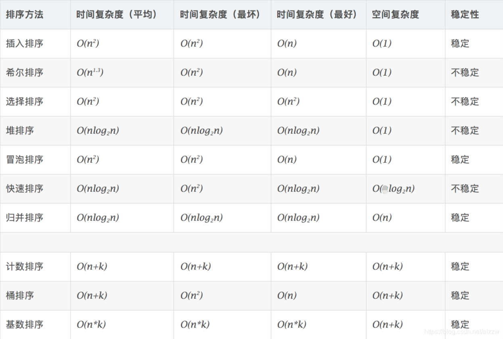

[参考博客](https://blog.csdn.net/alzzw/article/details/98100378)


# 复杂度


- 稳定性：
    - 指待排序的序列中有两元素相等,排序之后它们的先后顺序不变.
    - 也可以理解为一切皆在掌握中,元素的位置处在你在控制中.而不稳定算法有时就有点碰运气,随机的成分.

# BubbleSort
```C++
void BubbleSort(vector<int>& vec, int l, int r){
    if(l < r){
        for(int i=0; i<r; i++){
            if(vec[i] > vec[i+1])
                swap(vec[i], vec[i+1]);
        }
    }
    BubbleSort(vec, l, r-1);
}
```

# SelectionSort
```C++
void SelectionSort(vector<int>& vec, int n){
    while(n > 1){
        int max = vec[0], pos = 0;
        for(int i=0; i<n; i++){
            if(max < vec[i]){
                max = vec[i];
                pos = i;
            }
        }
        swap(vec[pos], vec[n-1];)
        n--;
    }
}
``` 

# InsertionSort
```C++
void InsertionSort(vector<int>& vec, int n){
    for(int i=1; i<n; i++){
        int key = vec[i], j = i;
        while(vec[j-1] > key){
            vec[j] = vec[j-1];
            j--;
            if(j==0)
                break;
        }
        vec[j] = key;
    }
}
```

# ShellSort
```C++
void ShellSort(vector<int>& nums) {
    int n = nums.size();
    for (int gap = n / 2; gap >= 1 ; gap /= 2) {
        for (int i = gap; i < n; ++i) {
            int j, key = nums[i];
            for (j = i - gap; j >= 0 && key < nums[j]; j -= gap) {
                // 依次后移
                nums[j + gap] = nums[j];
            }
            nums[j + gap] = key;
        }
    }
}
```

# MergeSort
```C++
void Merge(vector<int>& vec, int l, int mid, int r){
    vector<int> helper(vec);
    int lp = l, rp = mid+1, cp = l;
    while(lp<=mid && rp<=r){
        if(helper[lp] >= helper[rp]){
            vec[cp++] = helper[rp++];
        }else{
            vec[cp++] = helper[lp++];
        }
    }
    while(lp <= mid){
        vec[cp++] = helper[lp++];
    }
}
void MergeSort(vector<int>& vec, int l, int r){
    if(l < r){
        int mid = (l+r)>>1;
        MergeSort(vec, l, mid);
        MergeSort(vec, mid+1, r);
        Merge(vec, l, mid, r);
    }
}
```

# QuickSort
```C++
void QuickSort(vector<int>&nums, int l, int r) {    
    if (l >= r) 
        return;
    int x = rand() % (r - l + 1) + l;
    swap(nums[l], nums[x]);

    int pivot = nums[l], lp = l, rp = r;
    while (lp < rp) {
        while (nums[rp] >= pivot && lp < rp) 
            rp--;
        if (lp < rp)
            nums[lp] = nums[rp];
        while (nums[lp] <= pivot && lp < rp) 
            lp++;
        if (lp < rp)
            nums[rp] = nums[lp];
    }
    nums[lp] = pivot;
    QuickSort(nums, l, lp - 1);
    QuickSort(nums, lp + 1, r);
}
```

# HeapSort
```C++
void heapify(vector<int>& vec, int i, int n){
    int lp = 2*i+1, rp = 2*i+2;
    int largestId = i;
    if(lp < n && vec[largestId] < vec[lp]) 
        largestId = lp;
    if(rp < n && vec[largestId] < vec[rp])
        largestId = rp;
    if(largestId != i){
        swap(vec[largestId], vec[i]);
        heapify(vec, largestId, n);
    }
}
void HeapSort(vector<int>& vec){
    int n = vec.size();
    // 建堆
    for(int i=n/2-1; i>=0; i--){
        heapify(vec, i, n);
    }
    //排序
    for(int i=n-1; i>0; i--){
        swap(vec[i], vec[0]);
        heapify(vec, 0, i); 
        // 这里的i是堆去掉排序好的元素后的长度
    }
}
```

# BucketSort
```C++
//设置10个桶
int N = 10;
void BucketSort(vector<int> &vec){
    int n = vec.size();
    vector<vector<int>> bucket(N);
    for(int i = 0; i < n; i++)
	    bucket[vec[i] / 10].push_back(vec[i]);
    int k = 0;
    for(int i = 0; i < N; i++){
    	//对每个桶进行排序
    	sort(bucket[i].begin(), bucket[i].end());
    	for(int j=0; j<bucket[i].size(); j++)
    	    vec[k++] = bucket[i][j];//放入原数组	
    }
    vector<vector<int>>().swap(bucket); //释放空间
}
```

# RadixSort
```C++
int get_max(vector<int>& vec, int n)
{
    int max = vec[0];
    for (int i = 1; i < n; i++)
        if (vec[i] > max)
            max = vec[i];
    return max;
}

// 对数组按照"某个位数"进行排序(桶排序)
// exp -- 指数 0, 10, 100, ...
void count_sort(vector<int>& vec, int n, int exp)
{
    vector<int> output(n);             // 存储"被排序数据"的临时数组
    vector<int> buckets(10, 0);
    // 将数据出现的次数存储在buckets中
    for (int i = 0; i < n; i++)
        buckets[(vec[i]/exp)%10]++;
    // 更改buckets[i]。目的是让更改后的buckets[i]的值，是该数据在output[]中的位置。
    for (int i = 1; i < 10; i++)
        buckets[i] += buckets[i - 1];
    // 将数据存储到临时数组output中
    for (int i = n - 1; i >= 0; i--)
    {
        output[buckets[(vec[i]/exp)%10] - 1] = vec[i];
        buckets[(vec[i]/exp)%10]--;
    }
    // 将排序好的数据赋值给vec
    vec.swap(output);
}

void RadixSort(vector<int>& vec, int n)
{
    int max = get_max(vec, n);    
    // 从个位开始，对数组a按"指数"进行排序
    for (int exp = 1; max/exp > 0; exp *= 10)
        count_sort(vec, n, exp);
}
```
