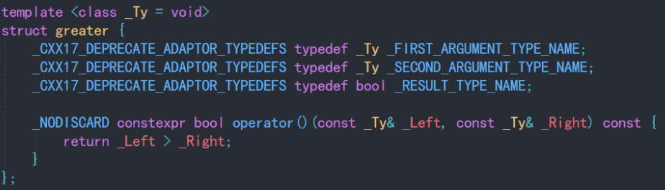

# 函数指针
## 指向函数存储内存地址的指针
```C++
// 创建一个 无参返回值为int 的函数指针
int (*funcPtr)();
```
## 把函数赋值给函数指针
```C++
int func1(){
    return 1;
}
int func2(){
    return 2;
}
void main(){
    int (*funcPtr)() = func1; 
    // C++会隐式得把func1 转换成 &func1, 无需加入&
    funcPtr = func2;
}
```
## 通过函数指针调用函数
```C++
int func3(int x){
    return x;
}
int (*funcPtr1)(int) = func3;
(*funcPtr1)(5);
funcPtr1(5);   //也可以这么使用，在一些古老的编译器上可能不行
```
## 把函数作为参数传入另一个函数
```C++
int add(int a, int b){
    return a+b;
}
int sub(int a, int b){
    return a-b;
}
void func(int e, int d, int(*func)(int a, int b)){
    cout<<func(e,d)<<endl;
}
void main(){
    func(2,3,add);
    func(2,3,sub);
}
```

# 仿函数
## 仿函数由来
- 是代替 **函数指针** 的手段
- 定义一个类，类里面重载函数运算符()，将该类的对象作为函数的入参，那么在函数中同样能调用重载符()里面的方法
- 所以说，仿函数就是仿造的函数，它并不是一个真正意义上的函数。它是一个类中的运算符()重载，但它具有函数的功能。
```C++
class Compare {
private:
    int m_Number;
public:
    Compare(int num) : m_Number(num){}
    bool operator()(int other){
        return m_Number > other;
    }
};
void main(){
    //定义对象调用
    Compare cmp(10);
    cout<< cmp(11);
    //通过临时对象调用
    cout<< Compare(10)();  
}
```

## 作用
- 在STL库中十分常见

### sort() 与 priority_queue 中的用法
```C++
typedef pair<string, int> PAIR;

bool cmpfunc(const PAIR& lhs, const PAIR& rhs) {  
    return lhs.second < rhs.second;  
}  

struct Compare {  
    bool operator()(const PAIR& lhs, const PAIR& rhs) {  
        return lhs.second < rhs.second;  
    }  
};

void main(){
    // 仿函数 并且是临时对象
    sort(vec.begin(), vec.end(), Compare());  
    // 直接传入函数指针 隐式将cmpfunc 转为 &cmpfunc
    sort(vec.begin(), vec.end(), cmpfunc);
    sort(vec.begin(), vec.end(), greater<int>());
    // 对priority_queue 只能传 结构体或类的 名称，不是对象！！！
    // 因为是定义 而不是像sort一样直接使用 仿函数 greater<int>()
    priority_queue<PAIR, vector<PAIR>, Compare > que;
    priority_queue<int, vector<int>, greater<int> > que;
}
```
### greater<int> 源码

是一个仿函数

