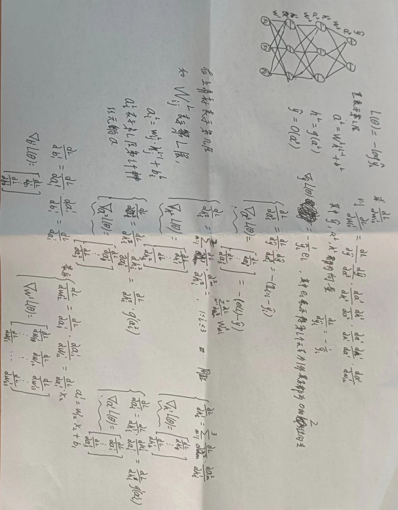

# 反向传播算法




# 梯度下降及其变体

## 批量梯度下降
```python
def do_gradient_descent():
    w,b,eta,max_epochs = -2,-2,1.0,1000
    for i in range(max_epochs):
        dw,db = 0,0
        for x,y in zip(X,Y):
            dw += grad_w(w,b,x,y)
            db += grad_b(w,b,x,y)
        w -= eta*dw
        b -= eta*db
```

## SGD
```python
def do_stochastic_gradient_descent():
	w,b,eta,max_epochs = -2,-2,1.0,1000
    for i in range(max_epochs):
        dw,db = 0,0
        for x,y in zip(X,Y):
            dw = grad_w(w,b,x,y)
            db = grad_b(w,b,x,y)
            w -= eta*dw
            b -= eta*db
```

## MiniBatch
```python
def do_mini_batch_gradient_descent():
    w,b,eta = -2,-2,1.0
    mini_batch_size,num_points_seen = 2,0
    for i in range(max_epochs):
        dw,db,num_points = 0,0,0
        for x,y in zip(X,Y):
            dw += grad_w(w,b,x,y)
            db += grad_b(w,b,x,y)
            num_points_seen += 1
            if num_points_seen%mini_batch_size == 0:
                w -= eta*dw
                b -= eta*db
                dw,db = 0,0
```

## Momentum
```python
def do_momentum_gradient_descent():
    w,b,eta = init_w,init_b,1.0
    prev_v_w,prev_v_b,gamma = 0,0,0.9
    for i in range(max_epochs):
        dw,db = 0,0
        for x,y in zip(X,Y):
            dw += grad_w(w,b,x,y)
            db += grad_b(w,b,x,y)
        v_w = gamma * prev_v_w + eta*dw
        v_b = gamma * prev_v_b + eta*db
        w -= v_w
        b -= v_b
        prev_v_w = v_w
        prev_v_b = v_b
```

## NAGD
```python
def do_nesterov_accelerated_gradient_descent():
    w,b,eta = init_w,init_b,1.0
    prev_v_w,prev_v_b,gamma = 0,0,0.9
    for i in range(max_epochs):
        dw,db=0,0
       	v_w = gamma * prev_v_w
        v_b = gamma * prev_v_b
        for x,y in zip(X,Y):
            dw += grad_w(w-v_w,b-v_b,x,y)
            db += grad_b(w-v_w,b-v_b,x,y)
        v_w = gamma*prev_v_w + eta*dw
        v_b = gamma*prev_v_b + eta*db
        w -= v_w
        b -= v_b
        prev_v_w = v_w
        prev_v_b = v_b
```

## Adagrad
```python
def do_adagrad():
    w,b,eta = init_w,init_b,0.1
    v_w,v_b,eps = 0,0,1e-8
    for i in range(max_epochs):
        dw,db = 0,0
        for x,y in zip(X,Y):
            dw += grad_w(w,b,x,y)
            db += grad_b(w,b,x,y)
        v_w += dw**2
        v_b += db**2
        w -= (eta/np.sqrt(v_w+eps)) * dw
        b -= (eta/np.sqrt(v_b+eps)) * db
```

## RMSProp
```python
def do_rmsprop():
    w,b,eta = init_w,init_b,0,1
    v_w,v_b,eps,beta1 = 0,0,1e-8,0.9
    for i in range(max_epochs):
        dw,db = 0,0
        for x,y in zip(X,Y):
            dw += grad_w(w,b,x,y)
            db += grad_b(w,b,x,y)
        v_w = beta1*v_w + (1-beta1) * dw**2
        v_b = beta1*v_b + (1-beta1) * db**2
        w -= (eta / np.sqrt(v_w+eps)) * dw
        b -= (eta / np.sqrt(v_b+eps)) * db
```

## Adam
```python
def do_adam():
    w,b,eta = init_w,init_b,0.1
    m_w,m_b,v_w,v_b,m_w_hat,m_b_hat,v_w_hat,v_b_hat,eps,beta1,beta2 = 0,0,0,0,0,0,0,0,1e-8,0.9,0.999
    for i in range(max_epochs):
        dw,db = 0,0
        for x,y in zip(X,Y):
            dw += grad_w(w,b,x,y)
            db += grad_b(w,b,x,y)
        m_w = beta1*m_w + (1-beta1) * dw
        m_b = beta1*m_b + (1-beta1) * db
        v_w = beta2*v_w + (1-beta2) * dw**2
        v_b = beta2*v_b + (1-beta2) * db**2
        m_w_hat = m_w / (1-math.pow(beta1, i+1))
        m_b_hat = m_b / (1-math.pow(beta1, i+1))
        v_w_hat = v_w / (1-math.pow(beta2, i+1))
        v_b_hat = v_b / (1-math.pow(beta2, i+1))
        w -= (eta / np.sqrt(v_w_hat+eps)) * m_w_hat
        b -= (eta / np.sqrt(v_b_hat+eps)) * m_b_hat
```