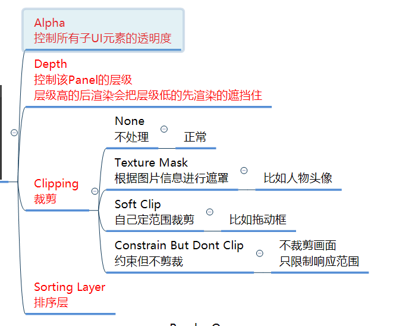

# NGUI概述
NGUI全称 下一代用户界面（Next-Gen UI）
它是第三方提供的Unity付费插件
专门用于制作Unity中游戏UI的第三方工具
相对于GUI它更适用于制作游戏UI功能
更方便使用，性能和效率更高

# Root组件
## 作用
- Root是用于 **分辨率自适应** 的 根对象
- 可以设置 基本分辨率,相当于设置 UI显示区域
- 并且管理所有UI控件的 分辨率自适应
可以简单理解 它管理一个 UI画布 所有的UI都是显示在这个画布上的
它会管理 UI画布 和 不同屏幕分辨率的 适应关系

## Root参数相关
主要包含三种缩放模式
1. **Flexible** 适用于可以手动拖窗口改变分辨率的设备 比如pc端

2. **Constrained** 适用于移动设备
因为移动设备都是全屏应用 不会频繁改变分辨率 只用适配不同分辨率的设备
一般使用：**横屏勾选 高fit** ; **竖屏勾选 宽fit**
需要注意的是: **背景图** 一定要考虑 **极限宽高比**来出 **最大宽高比**  19.9:9

3. **Constrained On Mobiles** 是上面两者的综合体 适用于多平台发布的游戏和应用

# Panel组件
## 作用
- 管理一个UI面板的渲染顺序
- 管理一个UI面板上的所有子控件

**tips**:
1. 在Root下创建多个Panel对象(挂载着Panel组件的空对象), **设置不同的depth**, 一般一个Panel管理一个面板, 可以理解为 Panel的depth 控制 Panel与Panel之间的层级关系，**类似于文件夹**
2. 同一Panel下的对象通过**自身的widget中的depth**来控制在**当前Panel下**的层级，**类似于文件夹中的文件**
3. 没有Panel父对象 UI控件看不到

## Panel参数相关

# EventSystem组件
也称为 **UICamera**
## 作用
主要作用是让摄像机渲染出来的物体 能接收到NGUI的**输入事件**
大部分设置不需要我们去修改
有了它我们通过鼠标 触碰 键盘 控制器 操作UI 响应玩家的输入

**tips**:
1. EventSystem很重要，如果没有它，我们没有办法监听玩家输入
2. 创建UI时的 2DUI 和3DUI 主要就是**摄像机的模式** (正交或透视) 不一样
3. EventSystem的2D和3D主要是 采用2D**碰撞器** 还是3D碰撞器, **不能直接改变摄像机模式**

## EventSystem参数相关

# 图集 Atlas
## 图集作用
NGUI中的最小图片控件**Sprite**要使用图集中的图片进行显示
图集 就是把很多单独的小图 合并为 一张大图 合并后的大图就是图集
**目的**：提高渲染性能

## 打开图集制作工具
- 方法一：**Project**右键打开
- 方法二：上方工具栏**NGUI——Open——Atlas Maker**

## 图集关键文件
1. 图集文件 (配置文件,包含小图在图集中的位置等信息)
2. 图集材质球
3. 图集图片

## 新建图集 及 创建修改删除图集元素
- 在图集工具**Atlas Maker**中操作
