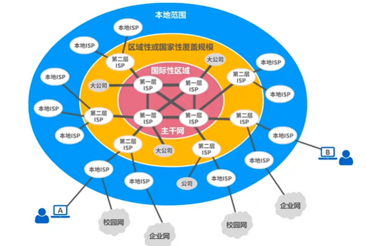
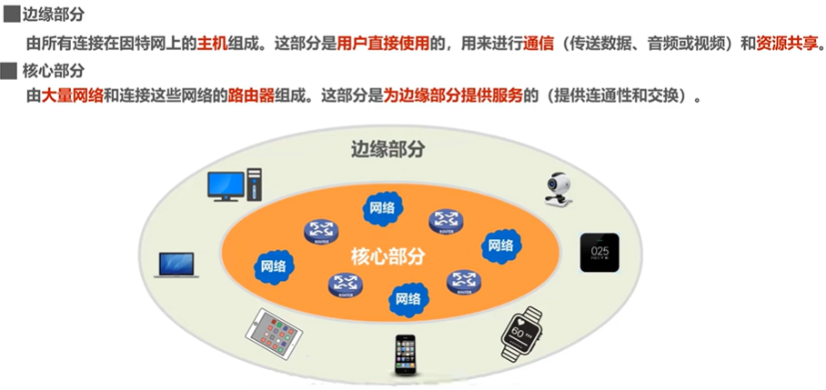
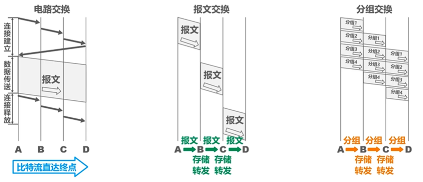
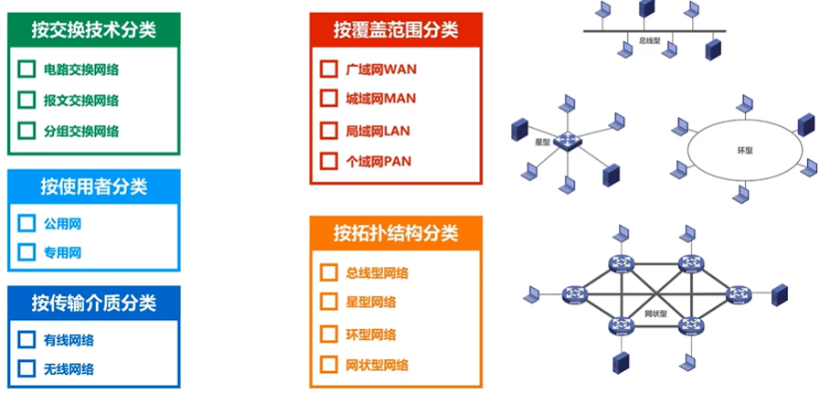
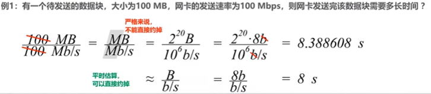
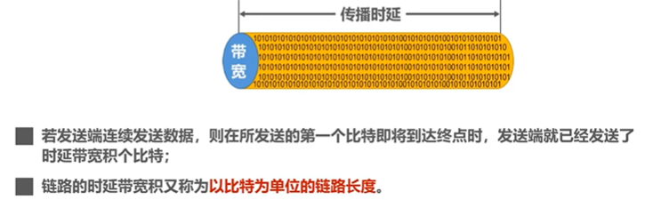
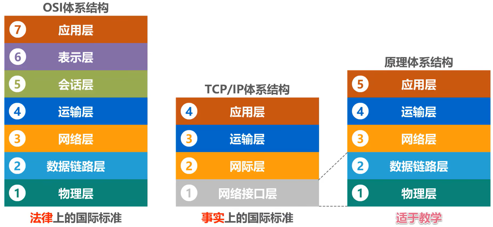
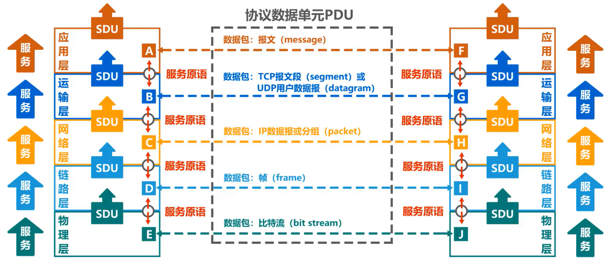

## 因特网
- 基于ISP的三层结构的因特网

- 因特网的组成

## 三种交换方式
### 电路交换
- 电话交换机 接通电话线的方式称为 电路交换
- 三个步骤：
    - 建立连接 （分配通信资源）
    - 通话 （**一直占用**通信资源）
    - 释放连接 （归还通信资源）  
- 传输计算机数据时效率很低 （因为计算机数据传输是 **突发式**的）

### 分组交换
- 通过路由器 传送 分组
- 三方：
    - 发送方： 构造分组、发送分组
    - 路由器： 缓存分组、转发分组 （**存储转发**）
    - 接收方： 接收分组、还原报文

### 报文交换
- 没有限制报文大小的交换， 需要各个节点交换机有较大的缓存空间

### 优缺点
#### 电路交换
- 优点：
    - 通信时延小
    - 有序传输
    - 没有冲突
    - 适用范围广
    - 实时性强
    - 控制简单
- 缺点：
    - 建立连接时间长
    - 线路独占、使用效率低
    - 灵活性差
    - 难以规格化
#### 报文交换
- 优点：
    - 无需建立连接
    - 动态分配线路
    - 提高线路可靠性
    - 提高线路利用率
    - 提供多目标服务
- 缺点：
    - 引起了转发时延
    - 需要较大存储缓存空间
    - 需要传输额外的信息量
#### 分组交换
- 优点：
    - 无需建立连接
    - 提高线路利用率
    - **简化了存储管理** （分组大小固定）
    - **加速传输**（在转发分组时可以同时存储下一个分组）
    - **减少出错概率和重发数据量**（分组小，从而出错概率小，重发量小）
- 缺点：
    - 引起了转发时延
    - 需要传输额外的信息量
    - **对于数据报服务，存在失序、丢失或重复分组的问题**
    - 对于虚电路服务，存在呼叫建立、数据传输和虚电路释放三个过程

## 计算机网络的分类

## 计算机网络的性能指标
### 速率
- 传送比特的速率，也称 **比特率**
- 单位：$bit/s   (bps)$
    - $kb/s = 10^3 bit/s$
- 速率单位中 是以 $10^3$ 进制的
- 数据量单位中 是以 $2^10$ 进制的

### 带宽
#### 在模拟信号系统的意义
- **信号**所包含的各种不同频率成分所占据的 **频率范围**
- 单位：$Hz (kHz, MHz, GHz)$
#### 计网中的意义
- 表示网络的**通信线路**所能传送数据的能力，因此网络带宽表示 **在单位时间内**从网络中的某一点到另一点所能通过的“**最高数据率**”
- 单位：$bit/s (bps)$ **与速率单位相同**

### 吞吐量
- 单位时间内通过某个网络的数据量
- 受网络的带宽或额定速率的限制

### 时延
- 由 发送时延、传播时延、处理时延构成
- 发送时延 = 分组长度(b) / 发送速率(b/s)
- 传播时延 = 信道长度(m) / 电磁波传播速率(m/s)
- 处理时延 不方便计算

### 时延带宽积
- 时延带宽积 = 传播时延 * 带宽

### 往返时间 RTT
Round-Trip Time 双向交互一次的时间 **RTT**

### 利用率
- 信道利用率： 用来表示某信道有百分之几的时间是被利用的(有数据通过)
- 网络利用率： 全网络的信道利用率的加权平均

- 当某信道的利用率增大时，该信道引起的时延也会迅速增加
- 如令 $D_0$ 表示网络空闲时的时延，$D$ 表示网络当前时延，可以用下面简化的公式表示时延与利用率 $U$的关系：
$$D = \dfrac{D_0}{1-U}$$

- 因此一些有较大主干网的ISP通常会控制它们的 信道利用率不超过 50%。

### 丢包率
- 即分组丢失率，在一定时间内，传输过程中**丢失的分组数**与**总分组数**的比率
- 分组丢失主要两种情况：
    - 分组在传输过程中出现**误码**, 被结点丢弃；
    - 分组到达一台队列已满的交换机时被丢弃，在通信量较大时造成**网络拥塞**
- 丢包率反应了网络的拥塞情况
    - 无拥塞时 丢包率为0
    - 轻度拥塞时 为 1% - 4%
    - 严重拥塞时 为 5% - 15%

## 计算机网络体系结构
### 体系结构层次

### 术语
- **实体**： 任何可发送或接受信息的**硬件**或**软件进程**
- **对等实体**： 收发双方**相同层次中的实体**

- **协议**：控制两个对等实体进行逻辑通信的规则的集合
- 协议的**三要素**： 语法  语义  同步
    - **语法** 定义所交换信息的格式
    - **语义** 定义收发双方所要完成的操作
    - **同步** 定义收发双方的时序关系

- 在协议的控制下，两个对等实体间的逻辑通信使得本层能向上一层提供**服务**
- 协议时 **“水平的”**， 服务是 **“垂直的”**

- **服务访问点**： 在同一系统中 **相邻两层的实体交换信息的逻辑接口**
    - 数据链路层 的 服务访问点为 帧的“类型”字段
    - 网络层 的 服务访问点为 IP数据报首部中的“协议字段”
    - 运输层 的 服务访问点为 “端口号”
- **服务原语**： 上层使用下层所提供的服务必须通过与下层**交换一些命令**，这些命令称为服务原语

- **协议数据单元PDU**: **对等层次之间传送的数据包** 称为该层的协议数据单元
- **服务数据单元SDU**: **同一系统内，层与层之间交换的数据包** 称为服务数据单元

