# 软件生命周期
**核心内容：软件生命周期的各过程**
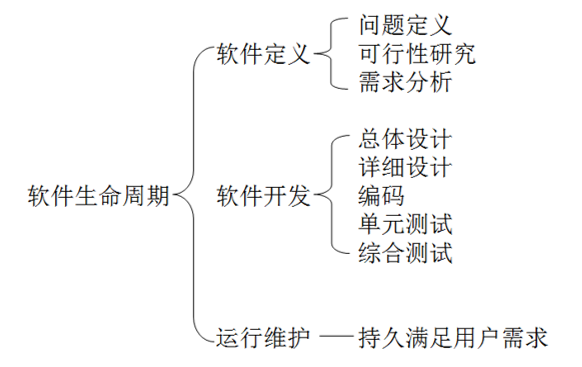

# 软件工程学概述
## 概念定义
- 软件工程是指导计算机软件开发和维护的一门工程学科。
- 采用**工程**的概念、原理、技术和方法来开发与维护软件。把正确的**管理技术**和当前能够得到的最好的**技术方法**结合起来，以经济地开发出高质量的软件并**有效地维护**它，这就是软件工程。

## 本质特性
- 软件工程关注于大型程序的构造
- 软件工程的中心课题是控制复杂性
- 软件经常变化
- 开发软件的效率非常重要
- 和谐地合作是开发软件的关键
- 必须有效地支持它的用户
- 两种背景的人创造产品这个特性与前两个特性紧密相关

## 基本原理
- 用分阶段的生命周期计划严格管理
- 坚持进行阶段评审
- 实行严格的产品控制
- 采用现代程序设计技术
- 结果应能清楚地审查
- 开发小组的人员应该少而精
- 承认不断改进软件工程实践的必要性

## 三要素
- **方法**：完成软件开发的各项任务的技术方法，回答“怎样做”的问题
- **工具**：为运用方法而提供的自动的或半自动的软件工程支撑环境
- **过程**：为了获得高质量的软件所需要完成的一系列任务的框架，它规定了完成各项任务的工作步骤

## 方法学
### 传统方法学
- 也称为生命周期方法学或结构化范型。
- 软件生命周期的全过程依次划分为若干个阶段，然后顺序地完成每个阶段的任务。
- 每个阶段的开始和结束都有严格标准，对于任何两个相邻的阶段而言，前一阶段的结束标准就是后一阶段的开始标准。

### 面向对象方法
面向对象方法把数据和行为看成是同等重要的，它是一种以数据为主线，把数据和对数据的操作紧密地结合起来的方法
#### 四个要点
- 把对象(object)作为融合了数据及在数据上的操作行为的统一的软件构件。
- 把所有对象都划分成类(class)。
- 按照父类与子类的关系，把若干个相关类组成一个层次结构的系统。
- 对象彼此间仅能通过发送消息互相联系
#### 基本原则
- 尽量模拟人类习惯的思维方式
- 从而使描述问题的**问题空间**(也称为问题域)与实现解法的**解空间**(也称为求解域)在**结构上尽可能一致**。
#### 优点
- **降低**了软件产品的**复杂性**，**提高**了软件的**可理解性**，**简化**了软件**开发和维护工作**
- 面向对象方法特有的继承性和多态性，进一步提高了面向对象软件的**可重用性**。

## 软件过程
- 软件过程是为了获得高质量软件所需要完成的一系列任务的框架，它规定了完成各项任务的**工作步骤**。
-  软件过程描述为了开发出客户需要的软件，什么人（who）、在什么时候（when）、做什么事（what）以及怎样（how）做这些事以实现某一个特定的具体目标。

### 瀑布模型
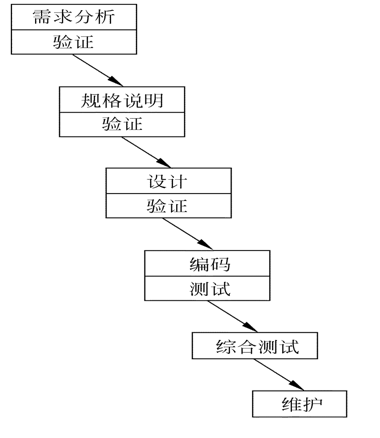

#### 特点
- 阶段间具有顺序性和依赖性
- 推迟实现的观点
- 质量保证的观点

#### 带反馈的瀑布模型
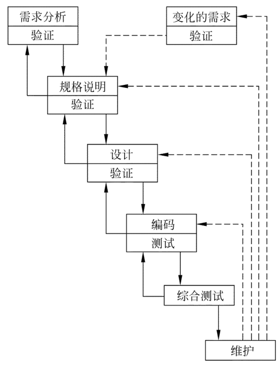

**实线箭头表示开发过程，虚线箭头表示维护过程**

- 当在后面阶段发现前面阶段的错误时，需要沿图中左侧的**反馈线返回**前面的阶段，修正前面阶段的产品之后再回来继续完成后面阶段的任务。

### 快速原型模型
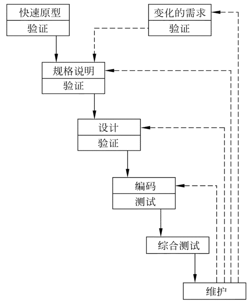

快速原型是快速建立起来的，可以在计算机上运行的程序，它所能完成的功能往往是最终产品能完成的功能的一个**子集**。

#### 相邻阶段无反馈的原因
- 原型系统**已经通过与用户交互而得到验证**，据此产生的**规格说明文档**正确地描述了用户需求，因此，在开发过程的后续阶段不会因为发现了规格说明文档的错误而进行较大的返工。

### 增量模型
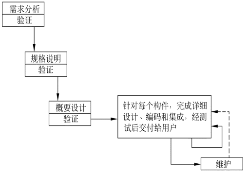

- 增量模型也称为渐增模型。核心思想是把软件产品作为一系列的**增量构件**来设计、编码、集成和测试。
- 第一个增量构件往往实现软件的基本需求，提供最核心的功能
#### 优点
- 能在较短时间内向用户提交可完成部分工作的产品
- 逐步增加产品功能可以使用户有较充裕的时间学习和适应新产品，从而减少一个全新的软件可能给客户组织带来的冲击。

### 螺旋模型
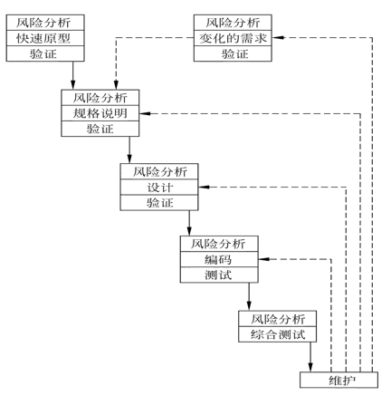

- 在每个阶段之前都**增加了风险分析过程**的快速原型模型。

### 喷泉模型
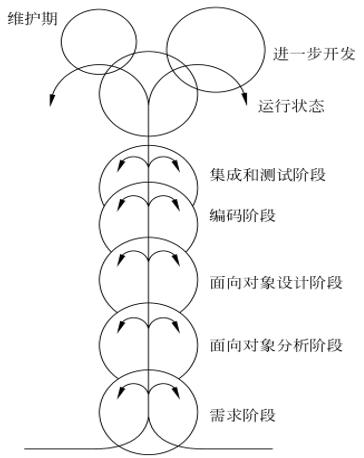

- 典型的**面向对象**的软件过程模型
- 图中在一个阶段内的向下箭头代表该**阶段内的迭代**
- 图中较小的圆圈代表维护，圆圈较小象征着采用了面向对象范型之后维护时间缩短了。

### Rational统一过程
- Rational Unified Process 简称 **RUP**
- RUP总结了经过多年商业化验证的6条最有效的软件开发经验，这些经验被称为“最佳实践”
    - 迭代式开发
    - 管理需求
    - 使用基于构件的体系结构
    - 可视化建模
    - 验证软件质量
    - 控制软件变更
#### 软件生命周期
- **初始阶段**： 建立业务模型，定义最终产品视图，并且确定项目的范围。
- **精化阶段**： 设计并确定系统的体系结构，制定项目计划，确定资源需求。
- **构建阶段**： 开发出所有构件和应用程序，把它们集成为客户需要的产品，并且详尽地测试所有功能。
- **移交阶段**： 把开发出的产品提交给用户使用
#### RUP中的迭代
每次迭代都是一个小的瀑布模型

### 敏捷过程 Agile
- 最早是为了与传统的瀑布软件开发模式相比较，所以当时的方法叫做轻量级方法（Light weight methods）

#### 敏捷过程核心思想

#### 四条价值观
- 人员交流重于过程与工具
- 软件产品重于长篇大论
- 客户协作重于合同谈判
- 随机应变重于循规蹈矩

#### 敏捷更符合软件开发规律
- 软件更像一个活着的植物，软件开发是自底向上逐步有序的生长过程，类似于植物自然生长
- 敏捷开发遵循软件客观规律，不断的进行迭代增量开发，最终交付符合客户价值的产品

#### 价值驱动 - 敏捷与传统瀑布型模式的最大区别
- 敏捷基于这种方式，可以实现研发过程的持续高可视性、高可适应性，更早且持续产出业务价值，更早发现和解决风险。

- 瀑布模型 基于 **计划驱动**

### 敏捷常用的工程方法
#### 极限编程
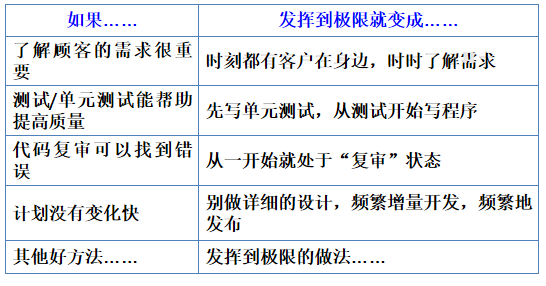

#### 整体开发过程

#### Scrum模型
- 三大特点
    - “可能性的”艺术 -- **关注当下**
    - 团队自组织，自管理 -- **放权**
    - 面对面沟通 -- **提高沟通**

- 三种角色
    - 产品负责人 PO
        - 负责管理**产品待办事项表（Product Backlog）**并保证其对于客户和团队保持透明度；
    - 团队负责人 SM
        - 不要管理团队。
    - 开发团队 5-9 人
- 三种工件
    - 产品待办事项表(产品Backlog)
    - 冲刺待办事项表(Sprint Backlog)
        - 包含产品待办事项列表中当前 Sprint 的子集
    - 产品增量
- 步骤
    - Step1 头脑风暴
    - Step2 PO决定实现的功能
    - Step3 时间估计: 用扑克牌游戏进行时间估计
    - Step4 冲刺
    - Step5 评估 PO

#### 微软开发过程
- 每一个生命周期发布一个递进的软件版本，各个生命周期持续、快速地迭代循环

# 可行性分析
描绘**物理系统** -> **系统流程图**
描绘**逻辑模型** -> **数据流图** / **数据字典**
**主要内容**
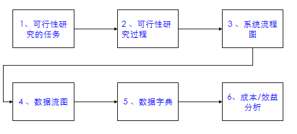

## 可行性研究的任务
### 含义
- 用最小的代价，在尽可能短的时间内（一般占总工作量的5％到10％）确定**能否解决问题**，以及**是否值得解决**的问题 。
- 因此，可行性研究的目的是“**做还是不做**”，而非“如何去做”。
### 内容
#### 从技术可行性
- 开发风险
- 资源有效性
- 技术方案
表述为：**做得了吗？做得好吗？做得快吗？**

#### 经济可行性
- 度量系统解决方案的性能价格比

#### 用户操作可行性
- 用户组织的结构、工作流程、管理模式及规范是否适合目标系统的运行，是否互不相容。
- 现有的人员素质能否胜任对目标系统的操作？
- 如果进行培训，时间是多少？成本如何？

#### 社会环境可行性
- 市场
- 政策
- 法律

## 可行性研究过程
1. 确定项目规模和目标；
2. 研究当前正在运行的系统；
3. 建立新系统的高层逻辑模型；
4. 导出和评价各种方案；
5. 推荐可行的方案；
6. 草拟开发计划；
7. 编写可行性研究报告，提交审查

## 系统流程图
### 基本符号
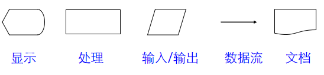

### 例子
#### 系统目标
1. 管理仓库各类零件数量的变化，并及时修改（更新库存清单文件）。
2. 报告库存零件达到库存量临界值的订货报告，产生订货信息。
3. 生成订货报表。
#### 构成部件
1. 输入终端CRT
2. 事务处理部件（库存清单程序）
3. 磁盘（存放库存清单主文件）
4. 磁带（存放订货信息）
5. 报告生成部件（报告生成程序）
6. 打印的文档（订货报告）
#### 绘制方法
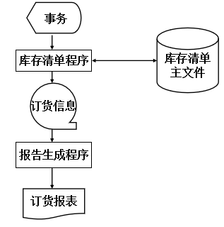

## 数据流图
以图形方式来表达系统的逻辑功能、数据在系统内部的逻辑流向和逻辑变换过程
### 基本符号
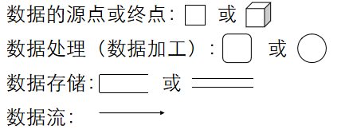

### 附加符号
**\***表示数据流之间“与”的关系（同时存在）
**\+** 表示数据流之间“或”的关系
$\oplus$ 表示数据流之间 “异或”的关系（不能同时存在）
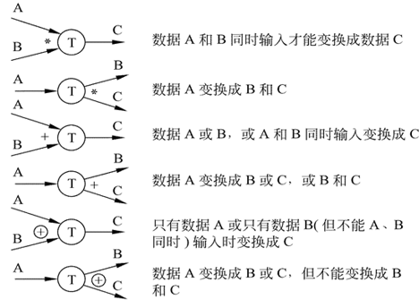

### 画数据流图的步骤
- Step1：画顶层数据流图,包括数据源点、终点，整个软件系统作为一个数据处理，流入和流出系统的数据流。
- Step2：一级细化，即画分层数据流图，逐层分解数据处理，得到功能级数据流图
- Step3：二级细化，进一步分解功能级数据流图到涉及功能具体的实现为止

### 数据流图的示例
#### 问题描述
- 工厂采购部每天需要一张订货报表，报表按零件编号编排，表中列出所有需要再次订货的零件（包括零件编号，零件名称，定货数量，当前价格，目前主要供应者，次要供应者）。
- 零件入库或出库称为**事务**，通过放在仓库中的CRT终端把事务报告给定货系统。
- 当某种零件的库存量少于库存临界值时就应该再次订货。

#### 问题分析
- **源点/终点**：仓库管理员/采购员
- **处理**：处理事务、产生订货报表
- **数据存储**：订货信息、库存清单
- **数据流**：订货报表、事务

#### 步骤
- Step1：绘制基本系统模型
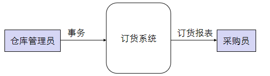

- Step2：得到功能级数据流图
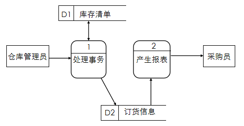

- Step3：细化到功能实现级别
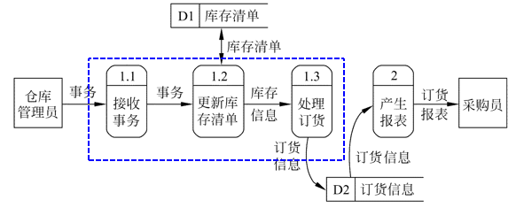

### 注意事项
1. 若一张数据流图中包含的数据处理多于7时，其含义将难以领会，此时数据流图应该分层绘制
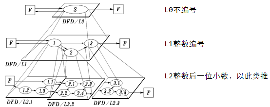

2. 数据流图分层细化时必须保持信息的连续性，即细化前后对应功能的输入输出数据必须相同。
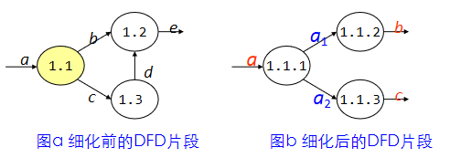

3. 数据存储和数据流都是数据，仅所处的状态不同，数据存储是静止状态的数据，数据流是运动状态的数据。

4. 所有的数据流都必须以一个数据处理开始，或以一个数据处理结束。即，**每个数据处理都应该有输入输出**。

### 各成分命名要求
#### 数据流(或数据存储)
- 代表整个数据流(或数据存储)的内容
- 不要使用缺乏具体含义的名字；
- 除流入流出**数据存储**的数据流可以命名相同之外，其他的数据流命名需要唯一，即便是同样内容

#### 数据处理(或数据加工)
- 先为数据流命名，再为处理命名，通常1个动词+宾语的命名方式
- 如果必须用两个动词才能描述整个处理的功能，则把这个处理再分解成两个处理可能更恰当些。
- 若处理的命名比较困难可能是处理包含太多功能

### 注意事项及命名练习
阅读下图所示的数据流图，找出其中错误之处
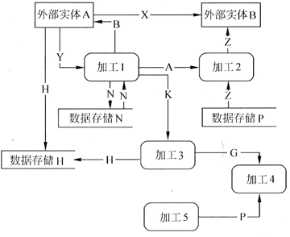

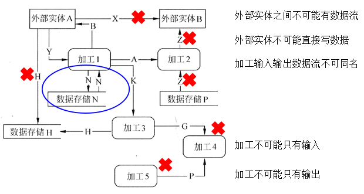

## 数据字典
### 数据字典的任务
- 对于数据流图中出现的所有被命名的图形元素在字典中作为一个词条加以定义，**使得每一个图形元素的名字都有一个确切的解释**

### 数据字典的定义
- 定义：是关于数据的信息集合，即对数据流图中包含的所有元素定义的集合。
- 数据字典和数据流图共同构成系统的逻辑模型，有数据字典，数据流图就不严格；没有数据流图，数据字典难于发挥作用。

### 定义内容
- **数据流**：来源、去向、组成、流通量
- **数据元素**：名称、别名、取值范围、含义、数据长度、小数位数、简单描述
- **数据存储**：数据结构及数据存放规则
- **数据处理**：数据处理的逻辑功能和主要算法

### 数据字典举例
#### 数据流定义
**对数据流和数据存储来说，需要定义到数据元素为止**
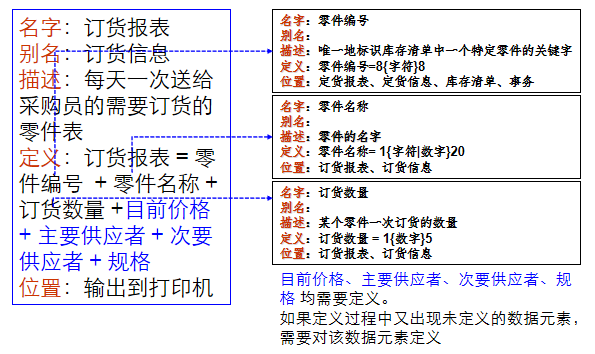

#### 数据项定义
由数据元素组成数据的方式
- 顺序：以确定次序连接两个或多个分量
- 选择：从两个或多个可能元素中选取一个
- 重复：把指定的分量重复零次或多次。
- 可选：一个分量是可有可无的

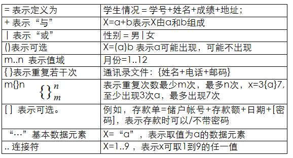

#### 数据项的定义练习
- 某酒店所提供的电话服务系统的功能为：
- 客人可以通过拨分机号联络酒店内的其他房间，也可拨外线号码与酒店外联络。
- 分机号从8201至8299。
- 外线号码需先拨0，然后加拨市话号码或长途电话号码
- 长途电话号码由区号和市话号码组成，其中区号可以为010、021~029、0300~0999中的任意一个数字串
- 市话号码是任意7位或8位长度的数字串。
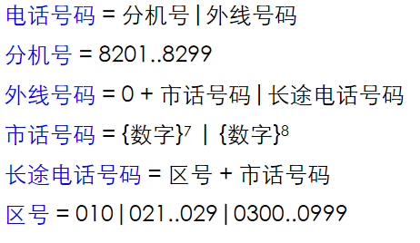

#### 加工定义
数据处理的定义可以采用结构化语言、IPO图、伪代码PDL、判定树、判定表等方式描述

## 成本/效益分析
从经济角度分析新系统的开发是否能盈利，帮助使用部门正确做出是否投资的决定。

### 常用的成本估算技术
- 代码行技术
    - **成本＝总代码行数×每行的平均成本**
    - 根据经验和历史数据，确定上面两个变量。此外，工资水平也是应考虑的一个重要因素。

- 任务分解技术
    - 根据生命周期瀑布模型，对开发工作将进行任务分解，分别估算每个任务的成本，累加得到总成本
    - **成本＝所需的总人月数×每人月的成本**
- 自动估计成本技术
    - 利用自动估计成本技术的软件工具进行计算
- 经验统计估计模型
    - Walston-Felix（IBM）模型
    - Putnam 估算模型（动态多变量参数模型）
    - COCOMO 模型
### 常用的效益度量方法
1. 货币的时间价值
2. 投资回收期
3. 纯收入
4. 投资回收率

### 成本/效益分析步骤
- 估计开发成本、运行费用和新系统带来的经济效益 
- 比较新系统的开发成本和经济效益。

### 可行性研究报告
- 根据DFD+DD、成本/效益分析等方面，进行技术可行性、经济可行性、用户操作可行性、社会环境可行性等方面评价，完成可行性研究报告，并提交审查
- 在审查过程中出现问题需要更改，通过多次迭代完成最终可行性报告，从而实现“是否做”的判断

# 需求分析
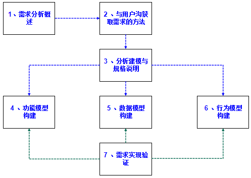

## 需求分析概述
### 需求的层次
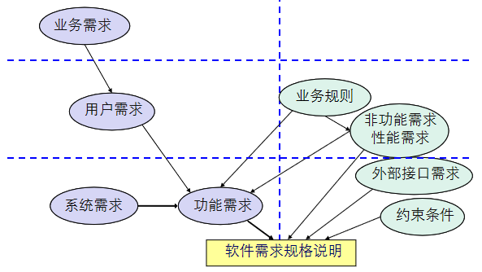

### 需求分析方法需遵守的法则
- 必须理解并**描述问题的信息域**，根据这条准则应该建立**数据模型**。
- 必须**定义**软件应完成的**功能**，这条准则要求建立**功能模型**。
- 必须描述作为外部事件结果的**软件行为**，这条准则要求建立**行为模型**
- 必须对**描述信息、功能和行为的模型**进行分解，用**层次**的方式展示细节。

## 与用户沟获取需求的方法
### 需求收集过程
- 访谈
    - **用户（user）**是一种泛称，它可细分为 **客户（customer）**、**最终用户（the end user）**和 **间接用户（或称为关系人）**。
        掏钱买产品的用户称为客户，而真正操作产品的用户叫最终用户。客户与最终用户可能是同一个人也可能不是同一个人。
- 面向数据流自顶向下求精
- 简易的应用规格说明技术
- 快速建立软件原型

## 分析建模与规格说明
### 需求分析应建立的模型
- **数据模型**：E-R图(ERD)，描述数据对象，数据对象之间的关系；
- **功能模型**：数据流图(DFD)，描述数据在系统中流动，变换的逻辑过程；
- **行为模型**：状态转换图(STD)，描绘了系统的各种行为模式和在不同状态之间转换的方式；
- **模型中心**：数据字典 (DD)。

### 撰写软件需求规格说明书

## 功能模型构建

## 数据模型构建

## 行为模型构建

## 需求实现验证